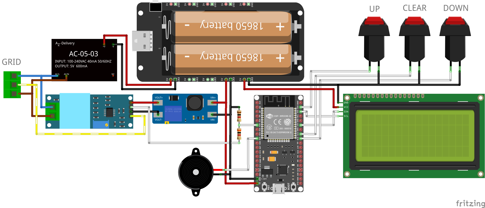
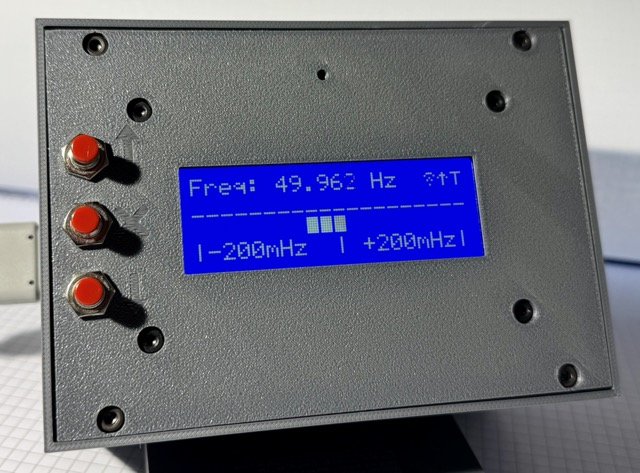

# OpenFreqSensor - Open Source Power Grid Frequency Monitor

A low-cost, high-precision power grid frequency monitoring solution for the European power grid. Monitor grid stability with ±0.002Hz precision and get instant alerts for frequency deviations.

#### Features

- 📊 Real-time frequency monitoring (±0.002Hz precision)
- 🔔 Local alerts via LCD display and buzzer
- 📡 MQTT data transmission
- 📱 20x4 LCD interface with button controls
- 🔋 Offline operation capability
- 📦 3D-printable case included



## Why Monitor Grid Frequency?

Frequency is the heartbeat of the electrical grid - it reflects the instantaneous balance between electricity generation and consumption across the entire Continental European network. When this balance shifts, frequency changes reveal:

- **Supply-Demand Imbalances**: Frequency drops when demand exceeds generation, rises when generation exceeds demand
- **System Response**: How quickly the grid compensates for disturbances through automatic controls
- **Regional Variations**: Local disturbances propagate through the interconnected network

Every frequency change tells a story about grid operations:

- **Slow Drifts (minutes)**: Indicate systematic generation-load imbalances, economic dispatch changes
- **Fast Changes (seconds)**: Reveal sudden events like generator trips, large load connections/disconnections
- **Oscillations**: Show control system interactions, potential stability issues
- **Rate of Change**: Indicates how rapidly the system is losing or gaining energy

By monitoring frequency, you gain insight into:

- **Early Warning System**: Detect grid disturbances before they escalate to blackouts
- **Load-Generation Balance**: Understand real-time supply and demand dynamics

Critical Thresholds (ENTSO-E Standards)

| Threshold                | Value            | Description                   |
| ------------------------ | ---------------- | ----------------------------- |
| Standard Frequency Range | 49.95 - 50.05 Hz | Normal operating range        |
| Alert Range              | 49.8 - 50.2 Hz   | Deviation monitoring required |
| Level 1 Emergency        | 49.2 - 50.8 Hz   | Emergency state               |
| Level 2 Emergency        | 47.5 - 51.5 Hz   | Blackout risk                 |
| Rate of Change (RoCoF)   | > ±0.5 Hz/s      | Dynamic stability threshold   |

Source: ENTSO-E Operation Handbook, Policy 1: Load-Frequency Control and Performance, Section A-S1: Standard Frequency Range Parameters. These are the official thresholds for the Continental Europe Synchronous Area.

## Live Demo and Data Analysis

View real-time frequency data from this sensor: [Live Dashboard](https://grafana.fastalert.nrw/public-dashboards/0828674a5dd54280aab2e0723ffaba71?orgId=3&refresh=1s)

For comprehensive grid analysis and historical data, visit [Energy-Charts](https://www.energy-charts.info/index.html?l=de&c=DE), maintained by Fraunhofer ISE.

## Getting Started

#### Hardware Requirements

- ESP32 development board [Link](https://www.az-delivery.de/en/products/esp32-developmentboard)
- 20x4 LCD display (I2C) [Link](https://www.az-delivery.de/en/products/hd44780-2004-lcd-display-bundle-4x20-zeichen-mit-i2c-schnittstelle)
- Push buttons (3x) [Link](https://www.amazon.de/-/en/pieces-momentary-pressure-lockless-dashboard/dp/B0DJNWWRSL)
- Buzzer [Link](https://www.az-delivery.de/products/buzzer-modul-passiv)
- ZMPT101B Active Single Phase Voltage Transformer [LINK](https://www.amazon.de/ANGEEK-ZMPT101B-Voltage-Transformer-Arduino/dp/B07ZDJS7CD)
- 5V USV Module [LINK](https://de.aliexpress.com/item/1005009864874228.html)
- HDR-15 Power Supply [LINK](https://www.amazon.de/-/en/Amazon-Parent-MeanWell-Series-HDR-15/dp/B06XWQSJGW)

##### 3D Printable Case

The device housing consists of three parts that can be 3D printed:

- [Part 1 (Base)](Part1.stl)
- [Part 2 (Display Frame)](Part2.stl)
- [Part 3 (Cover)](Part3.stl)

Print Settings:

- Material: PETG or ABS recommended (better heat resistance than PLA)
- Layer Height: 0.2mm
- Infill: 25%

#### Software

1. **Hardware Setup**

   - Follow the provided schematic
   - Print the case using provided STL file
   - Connect components according to pin configuration:
     ```
     ADC Input: GPIO34
     LCD: SDA -> GPIO21, SCL -> GPIO22
     Buttons: Up -> GPIO23, Down -> GPIO19, Mute -> GPIO18
     Buzzer: GPIO25
     ```

2. **Software Setup**

   ```bash
   # Clone the repository
   git clone https://github.com/calkoe/OpenFreqSensor
   
   # Install PlatformIO
   # Open project in PlatformIO
   # Configure wifi settings in config.h
   # Build and upload
   ```

3. **Configuration**

   - Copy `include/config.template.h` to `include/config.h`
   - Edit `config.h` with your settings:

     ```cpp
     // Network settings
     #define WIFI_SSID "your_ssid"
     #define WIFI_PASSWORD "your_password"
     #define MQTT_SERVER "your_mqtt_server"
     #define MQTT_USERNAME "your_username"
     #define MQTT_PASSWORD "your_password"

     // Device identification
     #define SENSOR_ID "freqsensor/your_id"
     ```

   - The template file contains all available configuration options
   - `config.h` is ignored by git to keep your private settings secure

#### MQTT Data Format

The sensor publishes JSON messages with the following structure:

```json
{
  "sensorId": "freqsensor/koecher1", // Unique sensor identifier
  "time": 1761407894423, // UNIX timestamp in milliseconds
  "freq": 49.964, // Current grid frequency in Hz
  "amp": 167844.8, // Signal amplitude (ADC units)
  "quality": 0.012, // Measurement quality (lower is better)
  "alert": false, // Whether frequency exceeds thresholds
  "alertType": "none", // Type of alert if triggered
  "deviation": 0.036, // Deviation from 50 Hz
  "ramp": 0.002990723, // Rate of change in Hz/s
  "analyzingDelay": 250, // Processing time in ms
  "freeHeap": 111228, // Available ESP32 memory in bytes
  "heapUsage": 65.4, // Memory usage percentage
  "cpuFreq": 240, // CPU frequency in MHz
  "wifiRSSI": -60 // WiFi signal strength in dBm
}
```

#### Technical Details

- Sampling Rate: 512 Hz
- FFT Analysis Size: 512 samples
- Gaussian interpolation for high precision
- Ring buffer size: 4096 samples
- Analysis interval: 250ms

## Example Build

#### Completed Device

- Assembled with ESP32 and components
- 3D printed case
- LCD display showing real-time frequency readings

#### Testing Results

- Frequency accuracy: ±0.002Hz verified against reference meter
- Response time: <250ms for frequency changes
- MQTT connectivity: Stable data transmission
- Battery backup: 4+ hours operation during power outages



## Contributing

Pull requests are welcome. For major changes, please open an issue first to discuss what you would like to change.

## License

[MIT](LICENSE)

## Disclaimer and Safety Warning ⚠️

#### Legal Disclaimer

This project is provided "AS IS", without warranty of any kind, express or implied. By using this project, you agree that:

- The authors and contributors are NOT LIABLE for any damages or injuries arising from the use of this project
- This project is for EDUCATIONAL AND RESEARCH PURPOSES ONLY
- Any use of this project is AT YOUR OWN RISK
- The accuracy and reliability of measurements cannot be guaranteed
- This is NOT a certified measurement device

#### Safety Warning ⚡

This device:

- Connects to LETHAL MAINS VOLTAGE (230V AC)
- Should ONLY be built and installed by QUALIFIED PERSONNEL
- Requires proper electrical isolation and safety measures
- Must be properly enclosed in an insulated case
- Should never be operated without proper safety barriers

DO NOT attempt to build or use this device unless you:

- Are a qualified electrician or electrical engineer
- Fully understand the risks of working with mains voltage
- Know how to properly isolate high-voltage circuits
- Can implement proper safety measures

IMPROPER USE CAN RESULT IN:

- Electric shock
- Death
- Fire
- Property damage
